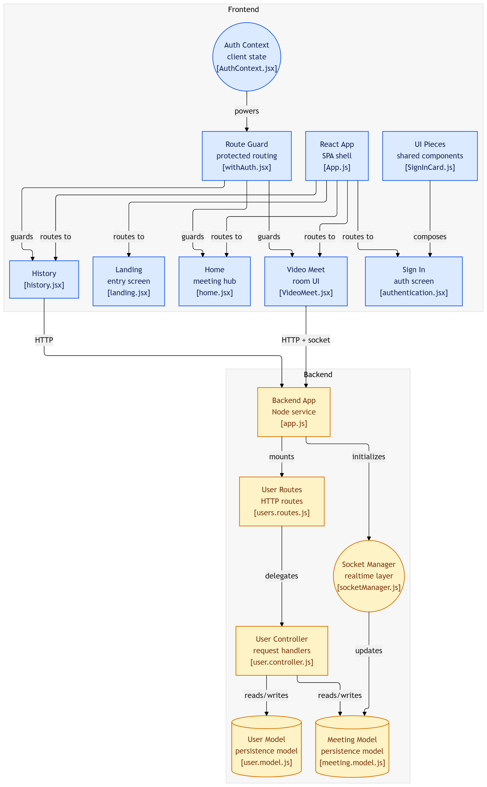
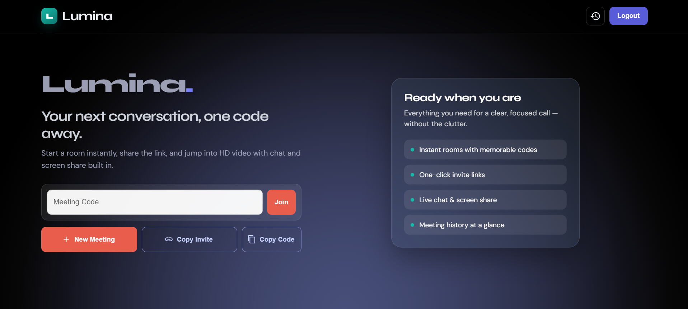
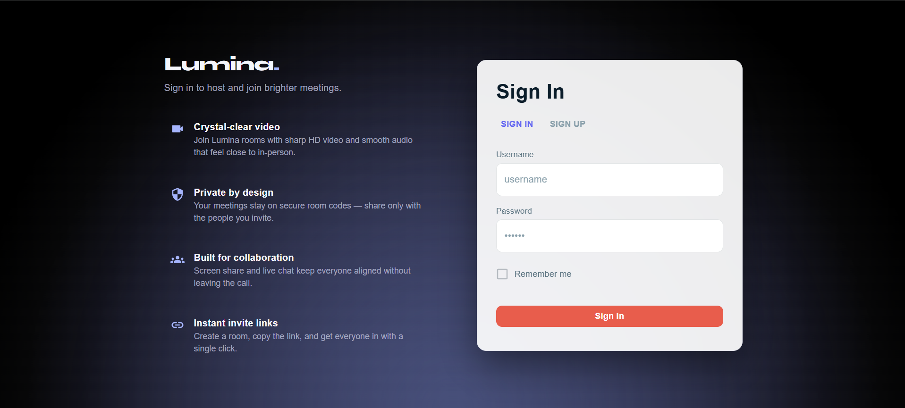
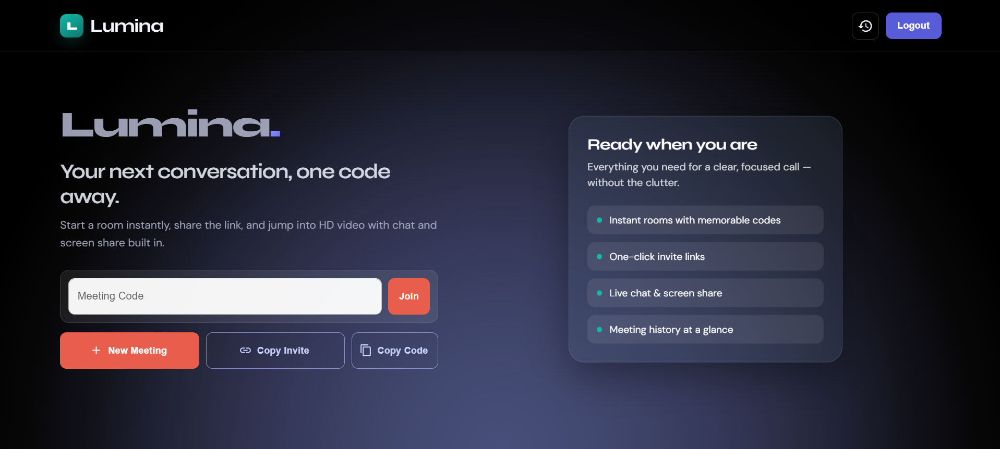
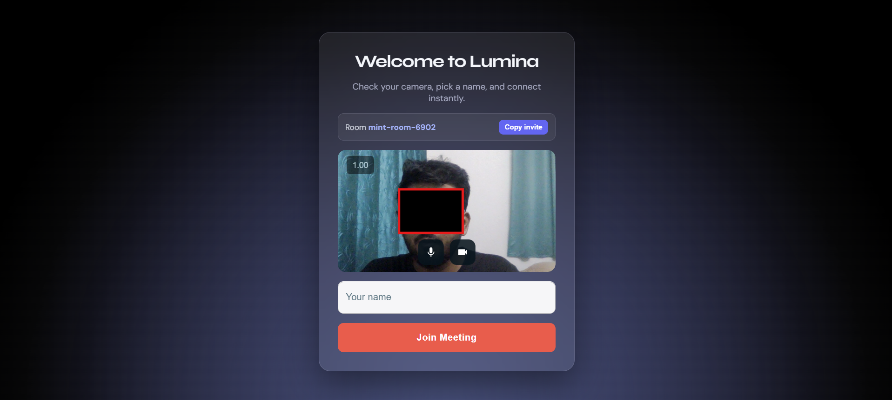
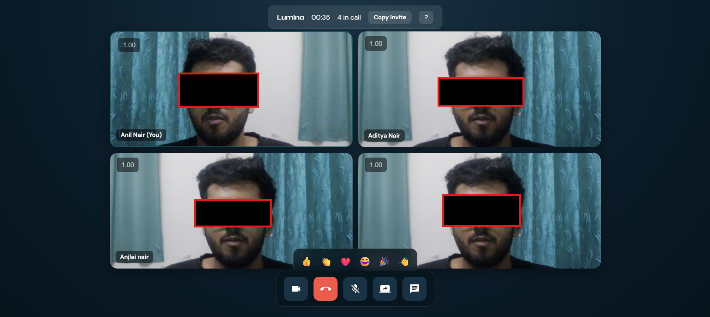
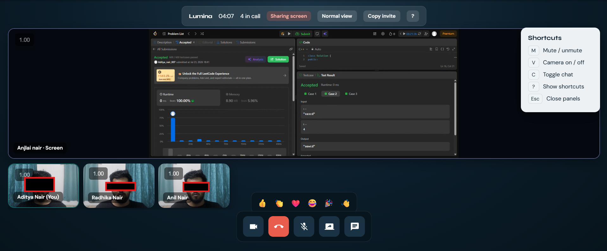
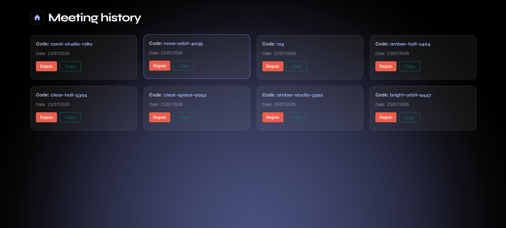

<h1 align="center">✨ Lumina</h1>

<p align="center">
  A full-stack <b>Zoom-style Video Conferencing Web App</b> built with <b>React</b>, <b>Node.js</b>, <b>Express</b>, <b>Socket.IO</b>, and <b>WebRTC</b>.<br/>
  Users can create or join meeting rooms instantly, communicate through real-time video and audio, react with emojis, and collaborate seamlessly from anywhere.
</p>

## 🌐 Live Demo
🔗 [Lumina on Render](https://lumina-frontend-8trw.onrender.com)

---

## 🏗️ Tech Stack

| Layer | Technology Used |
|-------|----------------|
| 💻 Frontend | React.js, CSS Modules, Material UI |
| ⚙️ Backend | Node.js, Express.js |
| 🗄️ Database | MongoDB with Mongoose |
| 🔄 Real-Time Communication | WebRTC, Socket.IO |
| 🔒 Authentication & Security | bcrypt, crypto |
| ☁️ Hosting | Render |

---

## 🗂️ Project Structure
```
├── Backend/
│   ├── src/
│   │   ├── controllers/
│   │   │   ├── socketManager.js
│   │   │   └── user.controller.js
│   │   ├── models/
│   │   │   ├── meeting.model.js
│   │   │   └── user.model.js
│   │   ├── routes/
│   │   │   └── users.routes.js
│   │   └── app.js
│   ├── package-lock.json
│   └── package.json
├── frontend/
│   ├── public/
│   └── src/
│       ├── contexts/
│       │   └── AuthContext.jsx
│       ├── pages/
│       │   ├── components/
│       │   │   ├── Content.js
│       │   │   ├── CustomIcons.js
│       │   │   ├── SignInCard.js
│       │   │   └── SignInStyle.css
│       │   ├── authentication.jsx
│       │   ├── history.jsx
│       │   ├── home.jsx
│       │   ├── landing.jsx
│       │   └── VideoMeet.jsx
│       ├── styles/
│       │   ├── history.css
│       │   ├── landingComponent.module.css
│       │   └── videoComponent.module.css
│       └── utils/
│           └── withAuth.jsx
├── images/
├── .gitignore
├── package.json
└── README.md
```

---

## ✨ Features

- 🔐 **User Authentication** — Secure signup and login with encrypted credentials
- 🎥 **HD Video Meetings** — Real-time video conferencing powered by WebRTC
- 🎙️ **Audio Controls** — Instantly mute and unmute your microphone
- 📹 **Video Controls** — Turn your camera on or off during meetings
- 💬 **Live Chat** — Exchange messages with all participants in real time (with unread badge counter)
- 🖥️ **Screen Sharing** — Share your screen for presentations and collaboration with smart screen-share layout switching
- 😊 **Emoji Reactions** — Send floating emoji reactions (👍 👏 ❤️ 😂 🎉 👋) visible to all participants
- 🔗 **One-Click Invite Links** — Copy and share meeting invite links directly from the dashboard or inside a call
- 🎯 **Memorable Meeting Codes** — Auto-generated human-readable room codes (e.g. `swift-hub-4291`)
- 🚪 **Guest Join** — Join a meeting without an account by entering a meeting code on the landing page
- 🪞 **Lobby / Pre-flight Screen** — Preview your camera and configure mic/camera before entering the room
- 👥 **Dynamic Participant Grid** — Adaptive video grid that scales automatically with the number of participants
- 🎬 **Spotlight / Screen-share Layout** — Presenter's screen is spotlighted while other participants appear in a sidebar strip
- ⏱️ **Live Call Timer** — Running call duration counter displayed in the top bar
- 🔔 **Join / Leave Chimes** — Subtle audio cues when participants enter or exit the room
- 📛 **Display Names** — Each participant is identified by their entered name throughout the call
- ⌨️ **Keyboard Shortcuts** — `M` mute, `V` video, `C` chat, `?` shortcuts panel, `Esc` close panels
- 📜 **Meeting History** — View a chronological log of all past meetings
- 🔒 **Protected Routes** — Secure user sessions and authenticated page access
- ⚡ **Real-Time Signaling** — Low-latency synchronization using Socket.IO
- 🌑 **Dark-themed UI** — Polished indigo/dark design with glassmorphism effects

---

## 🏗️ System Architecture

Lumina is a full-stack video conferencing platform built with **React**, **Node.js**, **Express**, **MongoDB**, **Socket.IO**, and **WebRTC**.



### Frontend

* **AuthContext** manages authentication state globally.
* **Protected Routes** secure private pages using a `withAuth` HOC.
* **Landing, Authentication, Home, Video Meet, and History** pages handle the complete user journey.

### Backend

* **Express Server** handles REST API requests.
* **User Routes & Controllers** manage authentication and user data.
* **Socket Manager** coordinates real-time signaling, reactions, screen-share notifications, and room events.

### Database

* **User Model** stores user credentials and information.
* **Meeting Model** records meeting details and history per user.

### Flow

1. Users authenticate (or join as guest) and access the app.
2. Frontend communicates with Express REST APIs.
3. Socket.IO handles real-time signaling, chat, and reactions.
4. WebRTC establishes peer-to-peer audio, video, and screen-sharing connections.
5. User and meeting data are persisted in MongoDB.

### Real-Time Communication

```text
User A ↔ Socket.IO ↔ User B
        ↓
      WebRTC
        ↓
 Audio • Video • Screen Share • Chat • Reactions
```

---

## 🧭 Pages & Features

### ✨ Landing Page (`/`)

A sleek, dark-themed landing page with a radial glow background, featuring the **Lumina** brand, a guest-join input bar, and clear CTAs to register or log in.



---

### 🔐 Sign In / Sign Up (`/auth`)

Secure user onboarding and login with encrypted credentials (bcrypt) to protect user data and personalize the meeting experience.



---

### 🏠 Dashboard (`/home`)

A streamlined dashboard where users can:
- Start a **New Meeting** with an auto-generated memorable code
- **Join** an existing meeting by code
- **Copy Invite Link** or just the meeting code
- Navigate to meeting history



---

### 🎙️ Lobby & Device Setup (`/:meetingCode`)

A pre-flight screen to preview your camera feed and toggle mic/camera before entering the meeting room. Enter your display name and join when ready.



---

### 👥 Conference Room (`/:meetingCode`)

A dynamic, responsive video grid that scales with participant count. Features include:
- Per-tile display names
- Mute/unmute & camera toggle
- Screen share with spotlight layout
- Floating emoji reactions
- Live chat panel with unread badge
- Live call timer and participant count
- Keyboard shortcuts panel
- One-click invite copy



---

### 💬 Collaboration Tools

Integrated live text chat and ultra-low-latency screen sharing. Chat history is preserved and replayed for users who join mid-meeting.



---

### 📜 Meeting History (`/history`)

A dedicated historical log showing a clean, chronological timeline of all past sessions and meeting codes for easy reference and re-joining.



---

## 🚀 Installation & Setup

### 1. Clone the repository

```bash
git clone https://github.com/Aditya-Nair07/Zoom.git
cd Zoom
```

### 2. Install dependencies

#### Backend

```bash
cd Backend
npm install
```

#### Frontend

```bash
cd frontend
npm install
```

### 3. Set up environment variables

Create a `.env` file inside the `Backend` directory:

```env
PORT=5000
MONGO_URI=your_mongodb_connection_string
JWT_SECRET=your_jwt_secret
CLIENT_URL=http://localhost:3000
```

> ⚠️ **Never commit your `.env` file.** It is already listed in `.gitignore`.

### 4. Run the application

#### Start Backend

```bash
cd Backend
npm start
```

#### Start Frontend

```bash
cd frontend
npm start
```

### 5. Visit in your browser

```
https://lumina-frontend-8trw.onrender.com
```

---

## 🧰 Skills & Tools Used

<p align="center">
  
</p>

<p align="center">
  
  
  
  
  
  
</p>

---

<p align="center">
  💡 Built with passion by <b>Aditya Nair</b>
</p>
